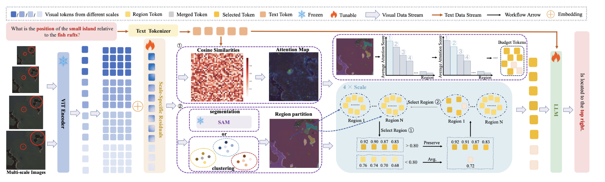

<h1 align="center">UHR-BAT</h1>

<h3 align="center">
Budget-Aware Token Compression Vision-Language Model for Ultra-High-Resolution Remote Sensing
</h3>

<p align="center">
  <a href="https://arxiv.org/abs/2604.13565"></a>
  <a href="https://yunkaidang.github.io/bibliography/dang2026uhr-bat/"></a>
  <a href="https://huggingface.co/RL-MIND/UHR-BAT"></a>
  <a href="https://huggingface.co/datasets/RL-MIND/UHR-BAT-SFT-10K"></a>
  <a href="https://huggingface.co/datasets/RL-MIND/XHRBench"></a>
  <a href="./LICENSE"></a>
</p>

<p align="center">
  <a href="https://yunkaidang.github.io/bibliography/dang2026uhr-bat/">Project Page</a> |
  <a href="https://arxiv.org/abs/2604.13565">Paper</a> |
  <a href="https://huggingface.co/RL-MIND/UHR-BAT">Model</a> |
  <a href="https://huggingface.co/datasets/RL-MIND/UHR-BAT-SFT-10K">SFT Data</a> |
  <a href="https://huggingface.co/datasets/RL-MIND/XHRBench">Eval Data</a>
</p>

UHR-BAT is a budget-aware vision-language framework for ultra-high-resolution remote-sensing understanding. It targets kilometer-scale scenes where query-critical evidence can occupy only a few pixels. Instead of relying on direct downsampling, dense tiling, or generic token pruning, UHR-BAT performs query-guided multi-scale token selection and region-faithful compression under an explicit visual-token budget.

## News

- **2026/06**: Source code, pretrained model, SFT data, and XHRBench evaluation data are released.
- **2026**: UHR-BAT is accepted by **ICML 2026**.

## Overview

UHR-BAT addresses this with a budget-aware compression pipeline:

- **Query-guided selection** allocates more visual tokens to regions related to the current instruction.
- **Multi-scale visual input** preserves both global scene structure and local evidence.
- **Region-faithful preserve-and-merge** keeps regional tokens while merging redundant background tokens.
- **Fixed token budgets** make memory, latency, and context usage easier to control.



## Repository Structure

```text
UHR-BAT/
├── uhr_bat/                 # Single-image inference and lmms-eval adapter
├── scripts/                 # Utility wrappers and released-data conversion
├── with_k-means/longva/      # K-Means token grouping branch
├── with-SAM/longva/          # SAM-guided region-mask branch
├── requirements.txt
└── pyproject.toml
```

Both LongVA branches expose the Python package name `longva`. Install only the branch you are actively using in one environment.

## Installation

Use Python 3.11 with CUDA 12.1. Install the base package and then choose one LongVA branch.

```bash
conda create -n geo python=3.11 -y
conda activate geo

pip install torch==2.1.2+cu121 torchvision==0.16.2+cu121 torchaudio==2.1.2+cu121 \
  --index-url https://download.pytorch.org/whl/cu121
pip install flash-attn==2.7.3 --no-build-isolation --no-cache-dir

git clone https://github.com/Yunkaidang/UHR-BAT.git
cd UHR-BAT
pip install -r requirements.txt --no-deps
pip install -e . --no-deps

# Choose one branch:
pip install -e with_k-means/longva --no-deps   # mask-free K-Means inference/evaluation
# pip install -e with-SAM/longva --no-deps     # SAM-mask training/evaluation
```

For offline servers, download the CLIP vision tower once and pass the local path with `--vision-tower`:

```bash
huggingface-cli download openai/clip-vit-large-patch14-336 \
  --local-dir checkpoints/clip-vit-large-patch14-336
```

## Model And Data

| Asset | Hugging Face repository | Use |
| --- | --- | --- |
| UHR-BAT checkpoint | [`RL-MIND/UHR-BAT`](https://huggingface.co/RL-MIND/UHR-BAT) | Released pretrained model with remote-code wrappers. |
| SFT data | [`RL-MIND/UHR-BAT-SFT-10K`](https://huggingface.co/datasets/RL-MIND/UHR-BAT-SFT-10K) | Supervised fine-tuning data. |
| Evaluation data | [`RL-MIND/XHRBench`](https://huggingface.co/datasets/RL-MIND/XHRBench) | Ultra-high-resolution remote-sensing benchmark. |

Download the public assets:

```bash
mkdir -p checkpoints data

huggingface-cli download RL-MIND/UHR-BAT \
  --local-dir checkpoints/UHR-BAT

huggingface-cli download RL-MIND/UHR-BAT-SFT-10K \
  --repo-type dataset \
  --local-dir data/UHR-BAT-SFT-10K

huggingface-cli download RL-MIND/XHRBench \
  --repo-type dataset \
  --local-dir data/XHRBench
```

Prepare the SFT annotations for LongVA-style training:

```bash
python scripts/prepare_uhrbat_sft.py \
  --metadata data/UHR-BAT-SFT-10K/train/metadata.parquet \
  --output data/UHR-BAT-SFT-10K/ft3_selected_10k.json
```

Layout notes:

- `RL-MIND/UHR-BAT-SFT-10K` is packaged as `train/metadata.parquet` plus `train/images/`.
- The released training scripts expect `JSON_PATH` to point to a LongVA/LLaVA-style JSON file and `IMAGE_FOLDER` to point to the image directory.
- `RL-MIND/XHRBench` includes `dataset.json` and `images/`; because `dataset.json` stores paths such as `images/xxx.png`, use `--image_root data/XHRBench`.
- Checkpoints, datasets, generated masks, and output folders are ignored by `.gitignore` and should not be committed.

## Quick Start

Run one image through the released checkpoint:

```bash
python -m uhr_bat.infer \
  --image /path/to/remote_sensing_image.png \
  --question "Describe this remote-sensing image briefly." \
  --ckpt checkpoints/UHR-BAT \
  --branch kmeans \
  --device cuda:0 \
  --attn-implementation flash_attention_2
```

The console entry point is equivalent:

```bash
uhr-bat-infer \
  --image /path/to/remote_sensing_image.png \
  --question "Describe this remote-sensing image briefly." \
  --ckpt checkpoints/UHR-BAT \
  --branch kmeans \
  --device cuda:0
```

For a relative image path inside XHRBench, pass the dataset root:

```bash
uhr-bat-infer \
  --image images/example.png \
  --image-root data/XHRBench \
  --question "Answer the question based on the image." \
  --ckpt checkpoints/UHR-BAT \
  --branch kmeans \
  --device cuda:0
```

Use `--attn-implementation none` if your environment does not have FlashAttention installed.

## Training

The main SFT recipe uses the SAM/mask branch. It expects a LongVA-style JSON file, an image folder, and precomputed multiscale token masks.

```bash
cd with-SAM/longva

GPU_IDS=0,1,2,3 \
RUN_NAME=uhr-bat-sam \
JSON_PATH=../../data/UHR-BAT-SFT-10K/ft3_selected_10k.json \
IMAGE_FOLDER=../../data/UHR-BAT-SFT-10K/train/images \
MASK_ROOT=/path/to/multiscale_tiles_masks \
CKPT_PATH=LongVA/LongVA-7B \
LOG_DIR=../../outputs/train_logs \
OUTPUT_DIR=../../outputs/checkpoints/uhr-bat-sam \
bash scripts/ft3_selected.sh
```

Important knobs:

- `TOPK_672`, `TOPK_1344`, `TOPK_2688`, `TOPK_4032`: visual-token budgets for each scale.
- `GPU_IDS`: comma-separated visible GPUs for `torchrun`.
- `CKPT_PATH`: base LongVA checkpoint or a previous UHR-BAT checkpoint.
- `MASK_ROOT`: multiscale token masks produced by `build_multiscale_token_masks.py`.

K-Means training is available at `with_k-means/longva/scripts/ft3_selected.sh` and does not require `MASK_ROOT`.

## Evaluation

Set a local CLIP vision tower path on offline or SSL-restricted machines:

```bash
export UHR_BAT_VISION_TOWER=/path/to/clip-vit-large-patch14-336
```

K-Means evaluation can run without precomputed masks. The same script supports XHRBench, XLRS-Bench-style JSON files, HR-Bench, and Tree-Bench when they are formatted as LongVA/LLaVA conversation JSON.

```bash
cd with_k-means/longva
python -u scripts/eval_xlrs_multiscale_to_json.py \
  --ckpt ../../checkpoints/UHR-BAT \
  --data_json ../../data/XHRBench/dataset.json \
  --image_root ../../data/XHRBench \
  --output_json ../../outputs/xhrbench_kmeans_results.jsonl \
  --multiscale_topk 80,320,600,2000 \
  --kmeans_num_clusters 600 \
  --kmeans_max_iters 100 \
  --devices cuda:0,cuda:1
```

Paper-style XLRS-Bench evaluation:

```bash
python -u scripts/eval_xlrs_multiscale_to_json.py \
  --ckpt ../../checkpoints/UHR-BAT \
  --data_json /path/to/XLRS/xlrs_lite_relative.json \
  --image_root /path/to/XLRS/images \
  --output_json ../../outputs/xlrs_kmeans_results.jsonl \
  --multiscale_topk 80,320,600,2000 \
  --kmeans_num_clusters 600 \
  --kmeans_max_iters 100 \
  --devices cuda:0,cuda:1
```

Paper-style RSHR-Bench evaluation is run on the HR-Bench and Tree-Bench splits:

```bash
python -u scripts/eval_xlrs_multiscale_to_json.py \
  --ckpt ../../checkpoints/UHR-BAT \
  --data_json /path/to/general-8K/HR-Bench/hr_bench_8k_metadata_relative.json \
  --image_root /path/to/dataset_root \
  --output_json ../../outputs/rshr_hrbench_kmeans_results.jsonl \
  --multiscale_topk 80,320,600,2000 \
  --kmeans_num_clusters 600 \
  --kmeans_max_iters 100 \
  --device cuda:0

python -u scripts/eval_xlrs_multiscale_to_json.py \
  --ckpt ../../checkpoints/UHR-BAT \
  --data_json /path/to/general-8K/Tree-Bench/TreeBench_metadata_relative.json \
  --image_root /path/to/dataset_root \
  --output_json ../../outputs/rshr_treebench_kmeans_results.jsonl \
  --multiscale_topk 80,320,600,2000 \
  --kmeans_num_clusters 600 \
  --kmeans_max_iters 100 \
  --device cuda:1
```

Use `--max_samples N` for a quick smoke test before launching the full benchmark. The script name keeps the original `xlrs` convention, but the loader accepts XLRS/MME-style JSON lists and XHRBench-style `dataset.json`.

## lmms-eval

UHR-BAT also provides an external `lmms-eval` adapter through the `lmms_eval.models` entry point.

```bash
git clone https://github.com/EvolvingLMMs-Lab/lmms-eval.git
cd lmms-eval
pip install -e .

cd ../UHR-BAT
pip install -e . --no-deps

lmms-eval --model uhr_bat \
  --model_args pretrained=checkpoints/UHR-BAT,device_map=auto,multiscale_topk=80:320:600:2000,multiscale_target_sizes=672:1344:2688:4032 \
  --tasks <task_name> \
  --batch_size 1 \
  --limit 10
```


## Citation

If you find this work useful, please cite our paper:

```bibtex
@inproceedings{dang2026uhrbat,
  title={UHR-BAT: Budget-Aware Token Compression Vision-Language Model for Ultra-High-Resolution Remote Sensing},
  author={Dang, Yunkai and Dai, Minxin and Yang, Yuekun and Li, Zhangnan and Li, Wenbin and Miao, Feng and Gao, Yang},
  booktitle={International Conference on Machine Learning (ICML)},
  year={2026}
}
```

## Acknowledgement

We thank the authors and maintainers of the following projects:

- [LongVA](https://github.com/EvolvingLMMs-Lab/LongVA)
- [Segment Anything](https://github.com/facebookresearch/segment-anything)
- [XLRS-Bench](https://github.com/AI9Stars/XLRS-Bench)
- [XHRBench](https://huggingface.co/datasets/RL-MIND/XHRBench)
